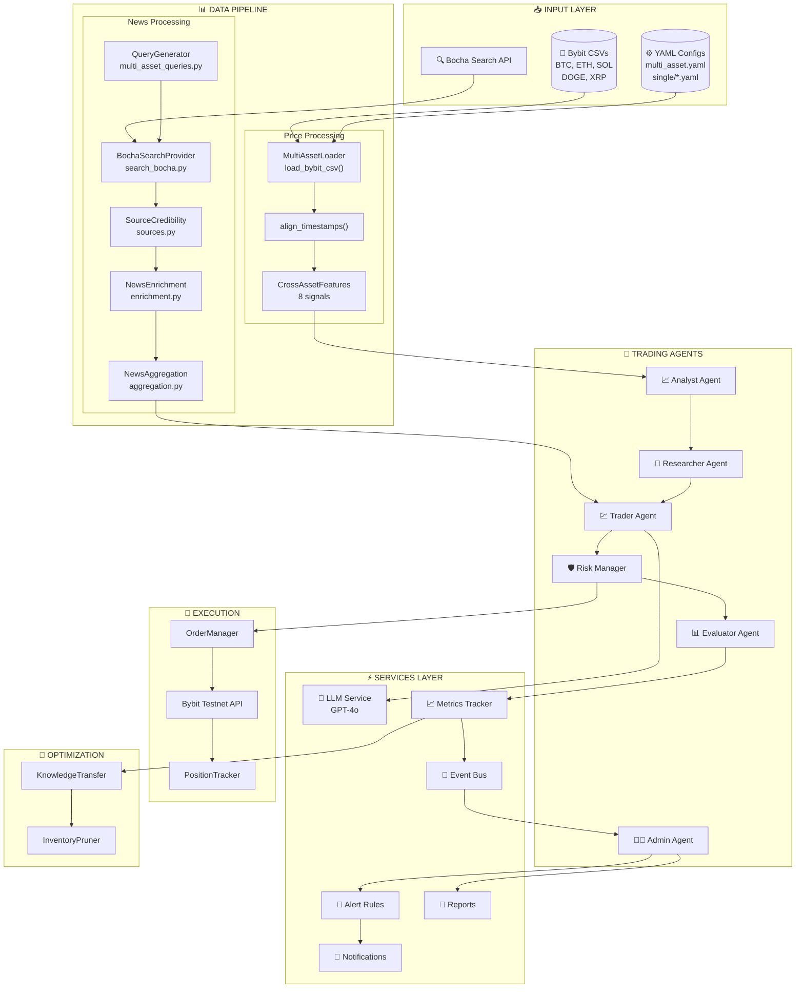
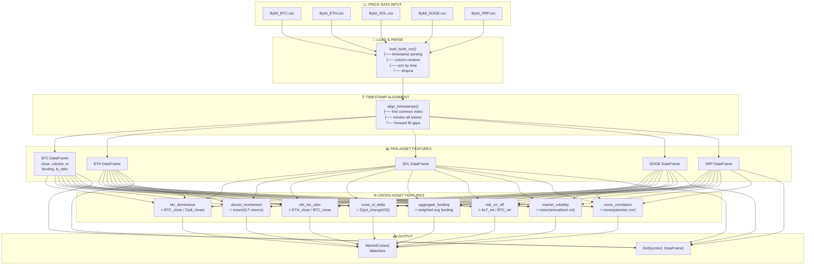
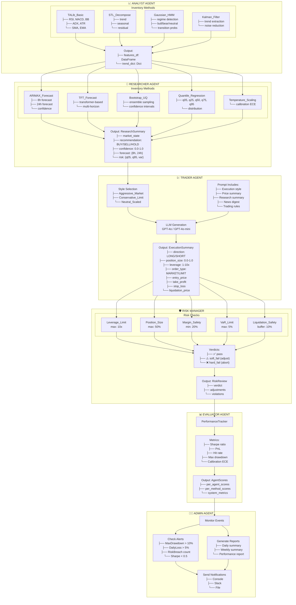
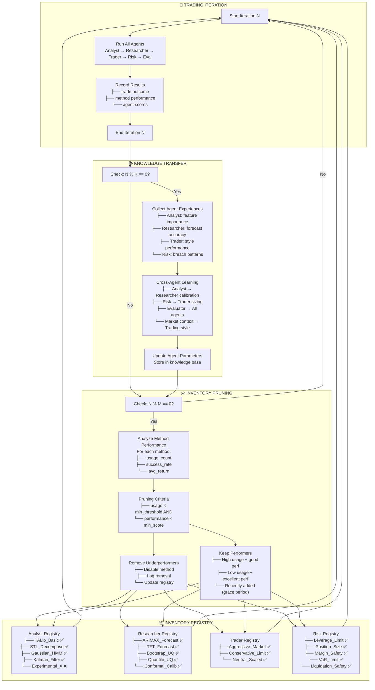
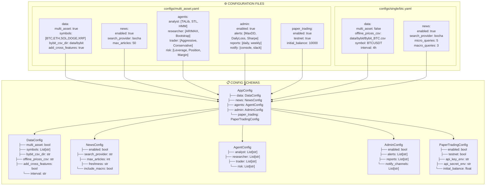

# Multi-Agent Trading System - Complete Architecture

## 🎯 System Overview



---

## 📊 Data Pipeline - Complete Flow



---

## 📰 News Pipeline - Complete Flow

```mermaid
flowchart TB
    subgraph QUERY_GEN["🔍 QUERY GENERATION"]
        ASSET_Q["ASSET_QUERIES dict<br/>├── BTC: 8 micro + 5 macro<br/>├── ETH: 6 micro + 5 macro<br/>├── SOL: 5 micro + 4 macro<br/>├── DOGE: 4 micro + 3 macro<br/>└── XRP: 5 micro + 4 macro"]

        MICRO["Micro Queries<br/>├── ETF flows<br/>├── Whale movements<br/>├── Mining/staking<br/>├── Technical analysis<br/>└── Exchange reserves"]

        MACRO["Macro Queries<br/>├── Fed interest rates<br/>├── CPI/inflation<br/>├── Regulation<br/>├── Geopolitical<br/>└── Market sentiment"]
    end

    subgraph SEARCH_EXEC["🔎 SEARCH EXECUTION"]
        BOCHA_API["Bocha Web Search API<br/>POST /v1/web-search<br/>├── query: string<br/>├── freshness: oneWeek<br/>├── count: 20<br/>└── summary: true"]

        RAW_RESULTS["Raw Results<br/>├── title<br/>├── snippet/summary<br/>├── url<br/>├── siteName<br/>└── datePublished"]
    end

    subgraph CREDIBILITY["⭐ SOURCE CREDIBILITY"]
        TIER1["Tier 1 (weight=1.0)<br/>├── bloomberg.com<br/>├── reuters.com<br/>├── wsj.com<br/>├── coindesk.com<br/>├── theblock.co<br/>└── sec.gov"]

        TIER2["Tier 2 (weight=0.7)<br/>├── decrypt.co<br/>├── bitcoinmagazine.com<br/>├── cryptoslate.com<br/>└── newsbtc.com"]

        TIER3["Tier 3 (weight=0.4)<br/>└── Unknown sources"]

        FILTER["filter_by_credibility()<br/>sort_by_credibility()"]
    end

    subgraph ENRICHMENT["🧠 LLM ENRICHMENT"]
        LLM_CALL["GPT-4o-mini<br/>enrich_with_llm()"]

        EXTRACT["Extract:<br/>├── sentiment: bullish/bearish/neutral<br/>├── sentiment_score: -1.0 to 1.0<br/>├── event_type: etf_flow/regulation/whale...<br/>├── entities: [BTC, BlackRock, SEC...]<br/>├── impact_timeframe: immediate/short/medium/long<br/>├── confidence: 0.0 to 1.0<br/>└── key_facts: [string list]"]

        ENRICHED["EnrichedNewsItem<br/>dataclass"]
    end

    subgraph AGGREGATION["📊 AGGREGATION"]
        DEDUP["deduplicate_by_content()<br/>TF-IDF + cosine similarity"]

        CLUSTER["Cluster by event_type<br/>├── etf_flow cluster<br/>├── regulation cluster<br/>├── whale_movement cluster<br/>└── technical cluster"]

        NARRATIVE["Generate narratives<br/>per cluster"]

        DIGEST["NewsDigest<br/>├── sentiment_score: weighted avg<br/>├── overall_sentiment: bull/bear/neutral<br/>├── sentiment_trend: improving/stable/declining<br/>├── dominant_narratives: [top 3]<br/>├── key_events: [sorted by impact]<br/>├── asset_sentiment: {BTC: 0.3, ETH: 0.1...}<br/>└── tier1_percentage: 0.65"]
    end

    subgraph OUTPUT_NEWS["📤 OUTPUT"]
        TO_TRADER["→ Trader Agent<br/>format_news_digest()"]
    end

    %% Connections
    ASSET_Q --> MICRO & MACRO
    MICRO & MACRO --> BOCHA_API
    BOCHA_API --> RAW_RESULTS

    RAW_RESULTS --> TIER1 & TIER2 & TIER3
    TIER1 & TIER2 & TIER3 --> FILTER

    FILTER --> LLM_CALL
    LLM_CALL --> EXTRACT --> ENRICHED

    ENRICHED --> DEDUP --> CLUSTER --> NARRATIVE --> DIGEST

    DIGEST --> TO_TRADER
```



---

## 🤖 Agent Workflow - Complete Flow



---

## ⚡ Services Layer - Complete Architecture

```mermaid
flowchart TB
    subgraph EVENT_BUS["📡 EVENT BUS"]
        PUBLISH["publish(event_type, data)"]
        SUBSCRIBE["subscribe(event_type, callback)"]

        EVENT_TYPES["Event Types:<br/>├── trade_signal<br/>├── order_submitted<br/>├── order_filled<br/>├── order_rejected<br/>├── position_update<br/>├── pnl_update<br/>├── risk_breach<br/>├── drawdown_alert<br/>├── iteration_complete<br/>├── system_health<br/>├── error<br/>└── warning"]
    end

    subgraph LLM_SERVICE["🧠 LLM SERVICE"]
        CREATE_CLIENT["_create_openai_client()<br/>├── API key from env<br/>└── custom base_url support"]

        GEN_PROPOSAL["generate_trading_proposal()<br/>├── execution_style<br/>├── research_summary<br/>├── news_digest<br/>├── price_data<br/>└── model selection"]

        FORMAT_NEWS["format_news_digest()<br/>├── sentiment score<br/>├── narratives<br/>├── key events<br/>└── asset sentiment"]

        FALLBACK["_fallback_proposal()<br/>Rule-based backup"]
    end

    subgraph METRICS_SERVICE["📈 METRICS SERVICE"]
        PERF_TRACK["PerformanceTracker<br/>├── record_trade()<br/>├── get_sharpe()<br/>├── get_pnl()<br/>├── get_hit_rate()<br/>├── get_max_dd()<br/>└── get_calib_ece()"]

        METHOD_TRACK["Method Tracking<br/>├── method_id<br/>├── usage_count<br/>├── success_rate<br/>└── avg_return"]
    end

    subgraph ALERT_SERVICE["🚨 ALERT SERVICE"]
        RULES["Alert Rules:<br/>├── MaxDrawdownRule(threshold=0.1)<br/>├── DailyLossRule(threshold=0.05)<br/>├── RiskBreachRule(max_breaches=3)<br/>├── LowSharpeRule(min_sharpe=0.5)<br/>└── PositionConcentration(max=0.5)"]

        CHECK["check(metrics) → bool"]
        TRIGGER["trigger() → Notification"]
    end

    subgraph NOTIFY_SERVICE["📢 NOTIFICATION SERVICE"]
        CHANNELS["Channels:<br/>├── ConsoleChannel<br/>├── SlackChannel<br/>├── FileChannel<br/>└── EmailChannel (TODO)"]

        SEND["send(channel, message, level)"]

        LEVELS["Levels:<br/>├── INFO<br/>├── WARNING<br/>├── ERROR<br/>└── CRITICAL"]
    end

    subgraph REPORT_SERVICE["📄 REPORT SERVICE"]
        REPORT_TYPES["Report Types:<br/>├── PerformanceReport<br/>├── DailySummary<br/>└── WeeklySummary"]

        GENERATE["generate(metrics, trades) → str"]
        SCHEDULE["Scheduled:<br/>├── Daily @ 8:00 AM<br/>└── Weekly @ Monday"]
    end

    subgraph BYBIT_SERVICE["🔷 BYBIT SERVICE"]
        CLIENT["BybitTestnetClient<br/>├── api_key, api_secret<br/>└── base_url (testnet)"]

        METHODS["Methods:<br/>├── place_order(symbol, side, qty, price)<br/>├── cancel_order(order_id)<br/>├── get_positions()<br/>├── get_wallet_balance()<br/>└── get_order_status(order_id)"]

        SIGN["_sign_request()<br/>HMAC-SHA256"]
    end

    subgraph ORDER_SERVICE["📋 ORDER SERVICE"]
        ORDER_MGR["OrderManager<br/>├── submit_order(proposal)<br/>├── monitor_fills()<br/>├── cancel_order(id)<br/>└── get_open_orders()"]

        ORDER_STATES["Order States:<br/>├── pending<br/>├── submitted<br/>├── partial<br/>├── filled<br/>├── cancelled<br/>└── rejected"]
    end

    subgraph POSITION_SERVICE["📊 POSITION SERVICE"]
        POS_TRACK["PositionTracker<br/>├── update_positions()<br/>├── get_position(symbol)<br/>├── calculate_unrealized_pnl()<br/>└── emit_pnl_events()"]

        POS_DATA["Position Data:<br/>├── symbol<br/>├── side<br/>├── size<br/>├── entry_price<br/>├── mark_price<br/>├── unrealized_pnl<br/>└── leverage"]
    end

    %% Connections
    PUBLISH --> EVENT_TYPES
    EVENT_TYPES --> SUBSCRIBE

    CREATE_CLIENT --> GEN_PROPOSAL
    FORMAT_NEWS --> GEN_PROPOSAL
    GEN_PROPOSAL --> FALLBACK

    PERF_TRACK --> METHOD_TRACK

    RULES --> CHECK --> TRIGGER

    CHANNELS --> SEND
    LEVELS --> SEND

    REPORT_TYPES --> GENERATE
    SCHEDULE --> GENERATE

    CLIENT --> METHODS
    SIGN --> METHODS

    ORDER_MGR --> ORDER_STATES

    POS_TRACK --> POS_DATA
```



---

## 🔄 Optimization Loop - Complete Flow



---

## 🎛️ Configuration Structure



---

## 📁 Complete Directory Structure

```
MAS_Final_With_Agents/
│
├── 📁 trading_agents/                    # Core trading system
│   │
│   ├── 📁 agents/                        # Agent implementations
│   │   ├── __init__.py                   # Agent exports
│   │   ├── base.py                       # BaseAgent class
│   │   ├── analyst.py                    # AnalystAgent
│   │   ├── researcher.py                 # ResearcherAgent
│   │   ├── trader.py                     # TraderAgent
│   │   ├── risk.py                       # RiskManagerAgent
│   │   ├── evaluator.py                  # EvaluatorAgent
│   │   ├── admin.py                      # AdminAgent
│   │   └── compose.py                    # Agent factory
│   │
│   ├── 📁 inventory/                     # Pluggable strategy methods
│   │   ├── __init__.py
│   │   ├── registry.py                   # @register decorator
│   │   │
│   │   ├── 📁 analyst/                   # Analyst methods
│   │   │   ├── __init__.py
│   │   │   ├── talib_basic.py            # TALib_Basic
│   │   │   ├── stl_decompose.py          # STL_Decompose
│   │   │   ├── hmm_regime.py             # Gaussian_HMM
│   │   │   └── kalman_filter.py          # Kalman_Filter
│   │   │
│   │   ├── 📁 researcher/                # Researcher methods
│   │   │   ├── __init__.py
│   │   │   ├── arimax_forecast.py        # ARIMAX_Forecast
│   │   │   ├── tft_forecast.py           # TFT_Forecast
│   │   │   ├── bootstrap_uq.py           # Bootstrap_UQ
│   │   │   ├── quantile_uq.py            # Quantile_UQ
│   │   │   └── temp_calib.py             # Temperature_Scaling
│   │   │
│   │   ├── 📁 trader/                    # Trader methods
│   │   │   ├── __init__.py
│   │   │   ├── aggressive_market.py      # Aggressive_Market
│   │   │   ├── conservative_limit.py     # Conservative_Limit
│   │   │   └── neutral_scaled.py         # Neutral_Scaled
│   │   │
│   │   └── 📁 risk/                      # Risk methods
│   │       ├── __init__.py
│   │       ├── leverage_limit.py         # Leverage_Limit
│   │       ├── position_size.py          # Position_Size
│   │       ├── margin_safety.py          # Margin_Safety
│   │       ├── var_limit.py              # VaR_Limit
│   │       └── liquidation_safety.py     # Liquidation_Safety
│   │
│   ├── 📁 config/                        # Configuration management
│   │   ├── __init__.py
│   │   ├── loader.py                     # load_config()
│   │   └── schemas.py                    # Dataclass schemas
│   │
│   ├── 📁 optimization/                  # Continual learning
│   │   ├── __init__.py
│   │   ├── knowledge_transfer.py         # KnowledgeTransfer
│   │   └── inventory_pruner.py           # InventoryPruner
│   │
│   ├── 📁 services/                      # Services layer
│   │   ├── __init__.py
│   │   ├── llm.py                        # LLM service
│   │   ├── metrics.py                    # PerformanceTracker
│   │   ├── events.py                     # EventBus
│   │   ├── alerts.py                     # Alert rules
│   │   ├── notifications.py              # Notification channels
│   │   ├── reports.py                    # Report generation
│   │   ├── bybit_client.py               # Bybit API client
│   │   ├── order_manager.py              # Order management
│   │   └── positions.py                  # Position tracking
│   │
│   ├── 📁 models/                        # Data models
│   │   ├── __init__.py
│   │   └── types.py                      # Dataclasses
│   │
│   ├── workflow.py                       # WorkflowEngine
│   └── cli.py                            # CLI interface
│
├── 📁 data_pipeline/                     # Data fetching
│   │
│   ├── 📁 news/                          # News intelligence
│   │   ├── __init__.py                   # Module exports
│   │   ├── llm_prompt_search.py          # LLM query planning
│   │   ├── multi_asset_queries.py        # Asset-specific queries
│   │   ├── sources.py                    # Source credibility
│   │   ├── enrichment.py                 # LLM enrichment
│   │   ├── aggregation.py                # News clustering
│   │   │
│   │   └── 📁 providers/                 # Search providers
│   │       ├── __init__.py
│   │       ├── search_bocha.py           # Bocha API
│   │       └── search_serpapi.py         # SerpAPI (legacy)
│   │
│   └── 📁 pipeline/                      # Price data
│       ├── __init__.py
│       ├── data_pipeline.py              # Unified entry point
│       ├── multi_asset.py                # Multi-asset loader
│       ├── cross_features.py             # Cross-asset signals
│       └── schemas.py                    # Data schemas
│
├── 📁 configs/                           # YAML configurations
│   ├── multi_asset.yaml                  # 5-coin config
│   ├── README.md                         # Config docs
│   │
│   └── 📁 single/                        # Per-coin configs
│       ├── btc.yaml
│       ├── eth.yaml
│       ├── sol.yaml
│       ├── doge.yaml
│       └── xrp.yaml
│
├── 📁 data/                              # Market data
│   ├── 📁 bybit/                         # Bybit CSV files
│   │   ├── Bybit_BTC.csv
│   │   ├── Bybit_ETH.csv
│   │   ├── Bybit_SOL.csv
│   │   ├── Bybit_DOGE.csv
│   │   └── Bybit_XRP.csv
│   │
│   ├── 📁 multi_asset/                   # Multi-asset outputs
│   └── 📁 single/                        # Single-asset outputs
│
├── 📁 docs/                              # Documentation
│   └── ARCHITECTURE.md                   # This file
│
├── .env                                  # Environment variables
├── pyproject.toml                        # Dependencies
├── README.md                             # Project README
└── RUN_DEMO.sh                           # Demo script
```

---

## 🔐 Environment Variables

```bash
# .env file

# OpenAI API
OPENAI_API_KEY=sk-...
OPENAI_API_BASE=https://api.openai.com/v1  # Optional

# Bocha Search API
BOCHA_API_KEY=sk-...

# Bybit Testnet (Paper Trading)
BYBIT_TESTNET_KEY=...
BYBIT_TESTNET_SECRET=...

# Notifications
SLACK_WEBHOOK_URL=https://hooks.slack.com/services/...  # Optional
```

---

## 🚀 Execution Flow Summary

```
1. Load Config (multi_asset.yaml)
       ↓
2. Initialize Services (EventBus, Metrics, LLM)
       ↓
3. Load Data
   ├── Price: Bybit CSVs → align → cross-features
   └── News: Bocha → credibility → enrich → aggregate
       ↓
4. For each asset (BTC, ETH, SOL, DOGE, XRP):
   │
   ├── 4a. Analyst Agent
   │   └── TALib, STL, HMM, Kalman → features + trends
   │
   ├── 4b. Researcher Agent
   │   └── ARIMAX, TFT, Bootstrap, Quantile → ResearchSummary
   │
   ├── 4c. Trader Agent
   │   └── LLM(research + news + market_context) → ExecutionSummary
   │
   ├── 4d. Risk Manager
   │   └── Check limits → pass / soft_fail / hard_fail
   │
   └── 4e. Execute (if pass/soft_fail)
       └── OrderManager → Bybit API → PositionTracker
       ↓
5. Evaluator Agent
   └── Calculate Sharpe, PnL, HitRate, MaxDD, ECE
       ↓
6. Admin Agent
   ├── Check alert rules
   ├── Generate scheduled reports
   └── Send notifications
       ↓
7. Optimization (every N iterations)
   ├── Knowledge transfer between agents
   └── Prune underperforming methods
       ↓
8. Next iteration → Step 3
```
